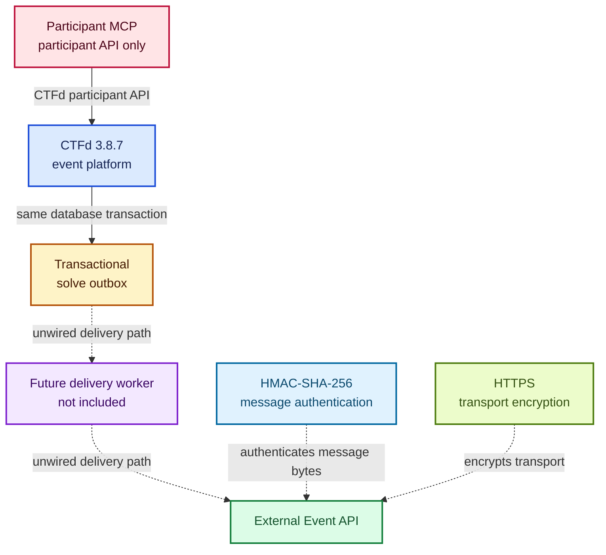
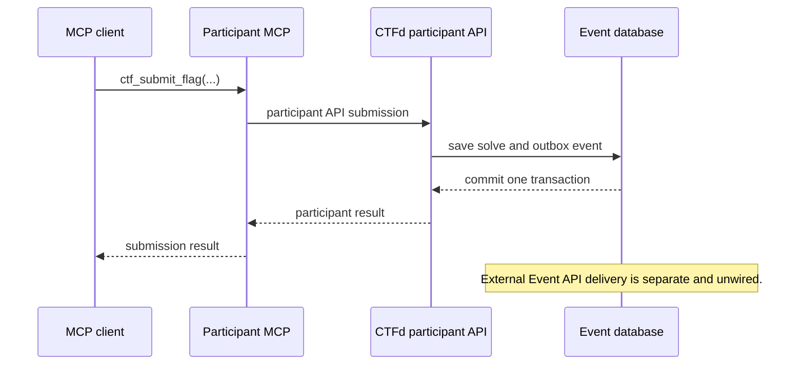

# Kernel Kittens CTF Event Platform and Participant Automation

An open-source CTFd fork for running capture-the-flag events, with a transactional solve outbox, a Rust event ledger prototype, and a participant-scoped MCP service.

The event website comes from CTFd. Kernel Kittens adds the event-recording and participant automation components described below. These additions are under development and require separate setup.

## What is included

| Component                                         | What it does                                                       | Current state                                                          |
| ------------------------------------------------- | ------------------------------------------------------------------ | ---------------------------------------------------------------------- |
| CTFd 3.8.7                                        | Event website, challenges, teams, submissions, and scoreboard      | Included in the root Docker Compose stack                              |
| [Solve outbox](CTFd/plugins/event_ledger_outbox/) | Records solve events in the same database transaction as the solve | Plugin and dispatcher helper exist; automatic delivery is not wired up |
| [Rust event ledger](services/event-ledger/)       | Receives signed events and stores them in SQLite                   | Local, single-writer prototype; started separately                     |
| [Participant MCP](services/participant-mcp/)      | Lets an MCP client use the participant-facing CTFd API             | Standalone Node.js service over stdio; started separately              |

## Architecture



Architecture in words: CTFd records accepted solves and the outbox writes a matching event in the same database transaction. A separately built delivery worker would send those events to a generic external Event API. That worker is not in this repository, so the delivery path is unwired. HMAC-SHA-256 authenticates the timestamp and message bytes. It does not encrypt the message. HTTPS encrypts traffic to an external Event API, and a deployed delivery client needs to provide that transport.

## Participant solve flow



Flow in words: An MCP client submits a flag through the participant MCP service. The service calls the participant CTFd API. If CTFd accepts the solve, CTFd saves the solve and its matching outbox event in one database transaction before returning the participant result. Delivery to an external Event API is a separate, unwired step.

## Start the event website

The included [Compose file](docker-compose.yml) starts CTFd, nginx, MariaDB, and Redis:

```sh
docker compose up
```

This starts the website stack only. It does not start the Rust ledger, a delivery worker, or the participant MCP. Review the Compose configuration and [CTFd deployment documentation](https://docs.ctfd.io/docs/deployment/installation/) before exposing an instance publicly.

## Participant automation

The MCP service exposes four tools:

- `ctf_list_challenges`
- `ctf_get_challenge`
- `ctf_get_scoreboard`
- `ctf_submit_flag`

It uses a participant's CTFd API token and has no direct database access or staff/admin tools. It requires Node.js 24 or later, a separate build, and the `CTF_API_BASE_URL` and `CTF_API_TOKEN` environment variables.

See the [participant MCP README](services/participant-mcp/README.md) for build, launch, and test instructions. Flag submission is a write operation and must not be treated as an idempotent request.

## Event recording

The outbox plugin records solve events transactionally. A dispatcher helper is present, but a future delivery client still needs an endpoint, signing secret, HTTPS transport, and scheduling. Starting Compose alone does not deliver events to the ledger or an external Event API.

The dispatcher creates an HMAC-SHA-256 signature over the timestamp and request body. That signature provides message authentication and integrity. It does not encrypt traffic. HTTPS is separate transport encryption, and this repository does not include a delivery client or TLS configuration.

The Rust service requires `EVENT_LEDGER_HMAC_SECRET`, accepts `EVENT_LEDGER_DATABASE` for its database location, and binds to `127.0.0.1:8080`. Its SQLite design is a local, single-writer foundation. Redundancy, multi-writer operation, and deployed recovery are not established.

See the [ledger design record](docs/adr/0002-rust-event-ledger.md) for the intended scope and limitations.

## Project status

As checked on September 6, 2026:

- The fork uses CTFd 3.8.7, which matches the [latest upstream stable release](https://github.com/CTFd/CTFd/releases/tag/3.8.7) on that date.
- Database CI workflows target the main branch.
- CI includes the Python database checks, Rust ledger contract tests, and participant MCP tests and type checks.
- No versioned GitHub release has been published.

This repository is a development foundation. A working website stack and passing lint do not establish that the additional services are ready for a live event.

## Upstream and license

Based on [CTFd](https://github.com/CTFd/CTFd), with additions by [Kernel Kittens](https://github.com/KernelKittens). Kernel Kittens did not author CTFd.

Licensed under the [Apache License 2.0](LICENSE).
